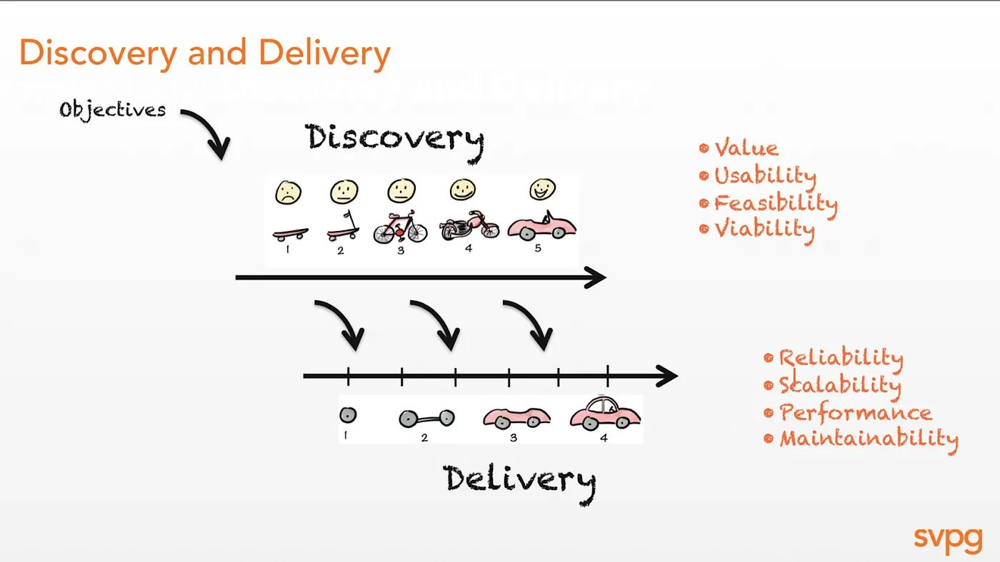
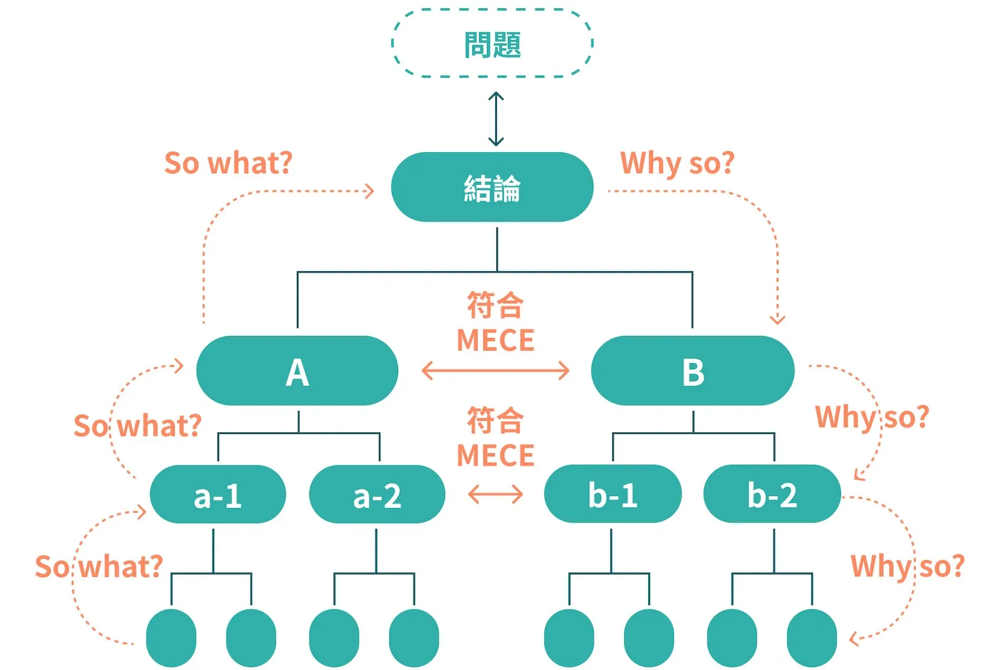
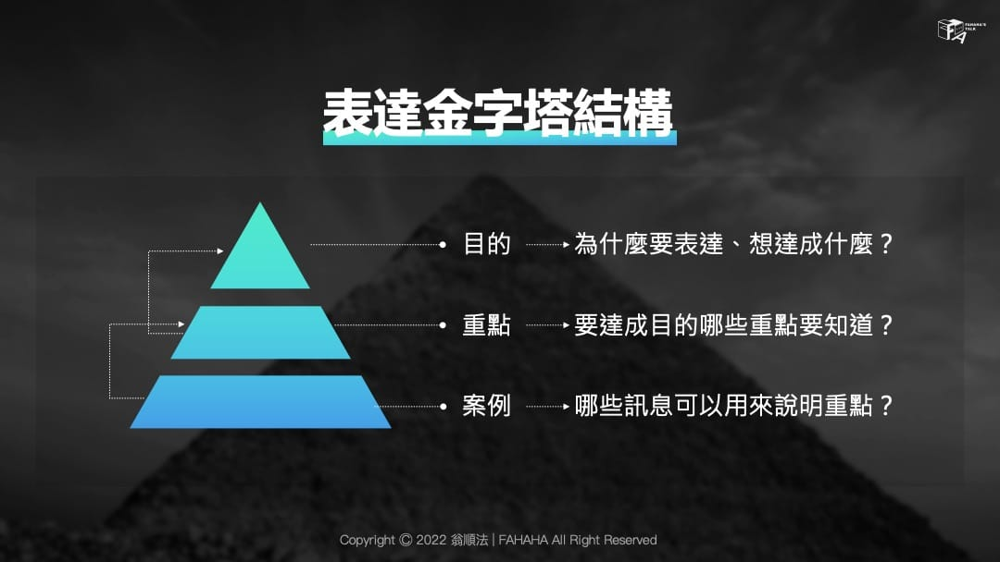
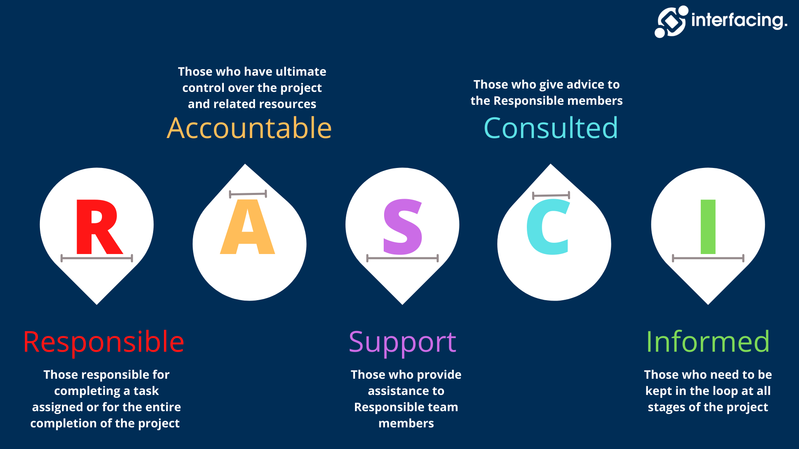
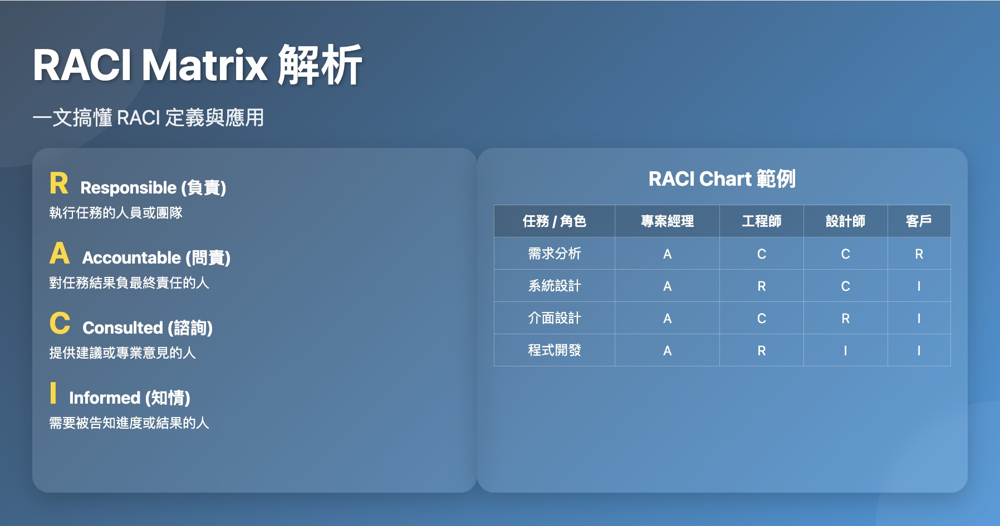
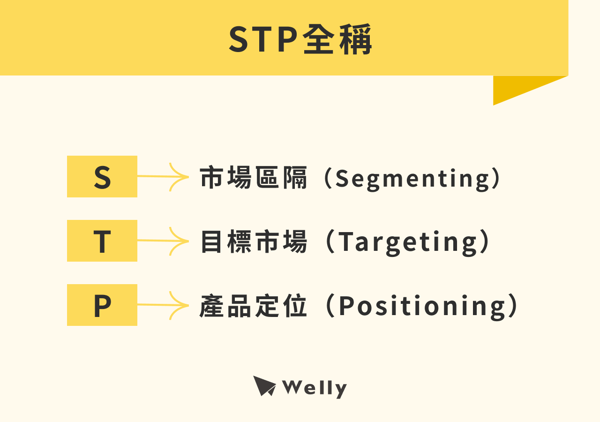

# Product Mangement

## ⭐️⭐️⭐️⭐️⭐️ 推薦閱讀
- [做產品真是哭夭難！ — Marty Cagan 演講 70 分鐘中文逐字翻譯（附贈 YouTube 錄影）](https://medium.com/3pm-lab/marty-cagan-producttank-taipei-speech-933e7dfc13af)

- [做產品真是哭夭難！ — Marty Cagan 演講 Q&A 中文逐字翻譯](https://medium.com/3pm-lab/marty-cagan-producttank-taipei-speech-qna-f4c9a6434c7c)

## 方法論

### Pyramid Principle & MECE
結論先行，上下呼應；彼此獨立，互無遺漏。

- [麥肯錫顧問都在用的問題解決法：MECE是什麼？](https://www.cheers.com.tw/article/article.action?id=5101995&page=1)

- [【麥肯錫企業內訓的思考工具：善用金字塔原則，提升簡報、寫作、溝通力】](https://fahahatalk.com/the-pyramid-principle/)

### RASCI/RACI
確定各角色在特定任務或流程中的責任和權限。

- [RACI Matrix是什麼？一文搞懂RACI 定義，附RACI Chart 範例！](https://projectmanager.com.tw/%E5%B0%88%E6%A1%88%E7%AE%A1%E7%90%86/raci/)

- [What is RASCI / RACI](https://interfacing.com/what-is-rasci-raci)

### STP
協助企業在更精準的市場中找到有利的定位。

- [STP是什麼？STP分析3步驟＋2大STP分析範例！一文搞懂市場分析](https://welly.tw/blog/what-is-stp)

